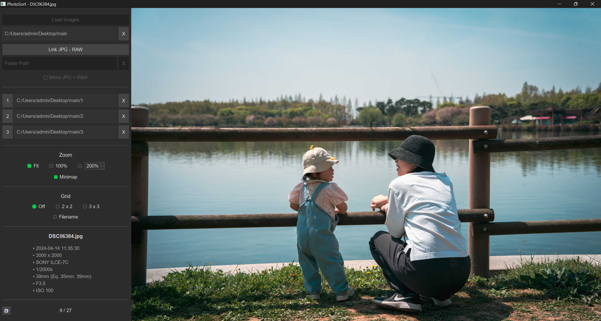

# PhotoSort 📸

**Effortless Photo Sorting for Busy People!**

**Are your family photos just piling up?** I know mine were. That feeling of never getting around to organizing them, maybe even feeling a bit overwhelmed opening those folders? I believe the photos we *keep* are the ones we actually *look at*.

That's why I built PhotoSort. As a dad who loves taking pictures (often in RAW+JPG!), I needed a faster way to sift through shots, pick the keepers, and maybe find the *really* good ones for editing later. Lightroom felt too heavy for just the initial sorting, and I couldn't find a lightweight tool that handled JPG+RAW pairs easily.

So, as a near-total coding beginner, I somehow managed to build this app with AI! It's simple, does one job well, and now I'm sharing it, hoping it helps someone else too.

PhotoSort helps you quickly categorize photos into folders (I use "Keep," "Maybe," "Delete Later," hence the 3 slots). It's designed to show your photos as large as possible while keeping the interface clean.

**Key Highlights:**

*   **Fast Sorting:** Use WASD or arrow keys to flip through photos, and press 1, 2, or 3 to move the current photo into a preset folder. 
*   **JPG+RAW Aware:** Optionally handles paired RAW files when you move JPGs.
*   **RAW Direct Load:** Load and sort RAW files directly if you prefer.
*   **Flexible Viewing:** Single view, 2x2/3x3 grids (F1-F3), Zoom/Pan, and a helpful Minimap.
*   **Safe:** **No delete function!** Photos are only *moved*, never deleted by the app.
*   **Simple & Clean:** Focused on the core sorting task.
*   **Totally Local & Portable:** Runs directly from the folder, no installation needed. Your photos stay on your PC.
*   **No Fluff:** No AI, no ads.

**Current Status:**

*   **From version 25.04.29**, you can download both Mac and Windows versions.
*   **Tested Resolutions:** Works well on my and my wife's laptops (2560x1600 & 1920x1080). Might look a bit off on 4K+ screens, haven't tested!
*   **Performance Note:** Loading RAW files directly might be slower on less powerful computers.
*   **Windows Defender Note:** Defender might flag the `.exe` (e.g., `Trojan:Win32/Sabsik.FL.A!ml`). This is likely a false positive due to the way Python apps are packaged (using Nuitka). I've reported it to Microsoft. The app is safe, and the source code is here for review. [VirusTotal Scan Result(v25.04.29)](https://www.virustotal.com/gui/file/48158c7faa11da4b644c83e2d4121f4a41d1e404e7c0e18b14d7db9c5c538b6c)

---

## Download & Run

1.  Go to the **[Releases](https://github.com/newboon/PhotoSort/releases)** page.
2.  Download the `PhotoSort_vX.X.X.zip` file from the latest release.
3.  Extract the zip file.
4.  Run `PhotoSort.exe`. No installation needed.

---

## Basic Usage

1.  Load a folder using the 'Load JPG' or 'Load RAW' button.
2.  (Optional) Link a RAW folder if needed.
3.  Click the 'Folder Path' labels next to `1`, `2`, `3` to set your destination folders.
4.  Use `WASD` or `Arrow Keys` to navigate photos.
5.  Press `1`, `2`, or `3` to move the current photo to the corresponding folder.
6.  Use `F1`, `F2`, `F3` to switch view modes.

---

## License

This project is licensed under the **MIT License**. See the `LICENSE` file for details.

---

## Support

Found a bug or have a suggestion? Please open an **[Issue](https://github.com/newboon/PhotoSort/issues)**.

